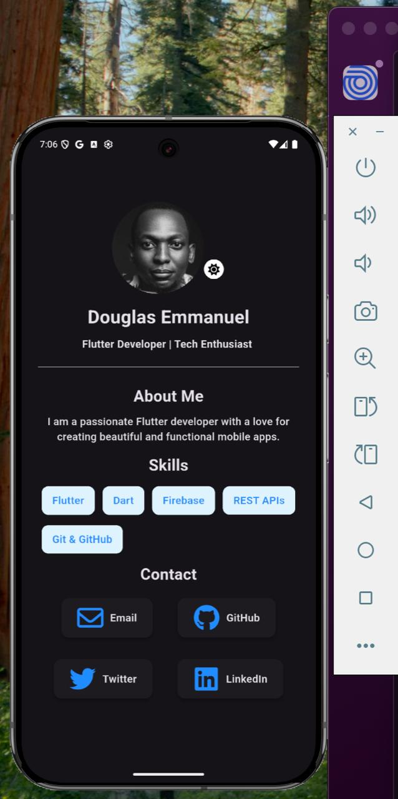
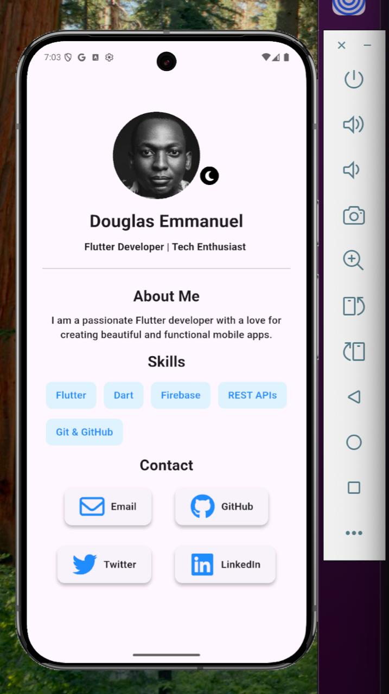

Absolutely 👍 — here’s a clean, professional **README.md** template you can use for your **Flutter personal portfolio app**.
It’s structured to look great on GitHub and convey everything clearly to visitors, recruiters, or collaborators.

---

## 🧑‍💻 Personal Portfolio App

A **beautiful, responsive personal portfolio** built with **Flutter**, designed to showcase your projects, skills, and contact information in one place.
This app runs seamlessly on **Android**, **iOS**, **Web**, and **Desktop** platforms.

---

### 📱 Features

✅ **Modern UI:** Clean, elegant, and responsive design
✅ **Cross-Platform:** Works on Android, iOS, Web, and Desktop
✅ **About Section:** Introduce yourself and your background
✅ **Projects Showcase:** Highlight your featured work
✅ **Skills Display:** List your tech stack and strengths
✅ **Contact Section:** Launch email, GitHub, LinkedIn, Twitter links directly
✅ **Dark/Light Mode Support** (optional)

---

### 🧩 Tech Stack

* **Framework:** Flutter (Dart)
* **UI Library:** Material Design
* **Icons:** Font Awesome Flutter
* **Plugins Used:**

  * [`url_launcher`](https://pub.dev/packages/url_launcher)
  * [`font_awesome_flutter`](https://pub.dev/packages/font_awesome_flutter)

---

### 🚀 Getting Started

#### 1. Clone this repository

```bash
git clone https://github.com/Douglasemmanuel/HNG-13-STAGE-0-MOBILE-DEV-.git
cd personal_portfolio_app
```

#### 2. Install dependencies

```bash
flutter pub get
```

#### 3. Run the app

```bash
flutter run
```

#### 4. Build release APK (optional)

```bash
flutter build apk --build-name 1.2.3 --build-number 99
```

---

### ⚙️ Folder Structure

```
lib/
 ├── main.dart   # Entry point
 |-- app.dart
 |-- provider/
 |    |-- theme_provider.dart  
 |-- theme/  
 |    |-- theme.dart
 |-- prefereneces
 |    |-- theme_preferences.dart      
 ├── widget/
 │    ├── contact.dart  
 |    |-- header.dart
 |    |-- skills.dart          
 |-- screen/
 │    ├── home_screen.dart      # Main home
 │    
 │    
 │   
```

---

### 🧠 How It Works

* Uses `url_launcher` to open external links (GitHub, LinkedIn, etc.)
* Responsive layout adapts to different screen sizes
* Supports external and in-app link handling for emulator compatibility

---

### 🧑‍🎨 Screenshots




---

### 🧰 Requirements

| Tool                     | Version |
| ------------------------ | ------- |
| Flutter SDK              | 3.19.0+ |
| Dart SDK                 | 3.3.0+  |
| Android Studio / VS Code | Latest  |
| Ios Simulator / Vs Code  | Latest  |

---


### 📝 License

This project is licensed under the **MIT License** – see the [LICENSE](LICENSE) file for details.

---

